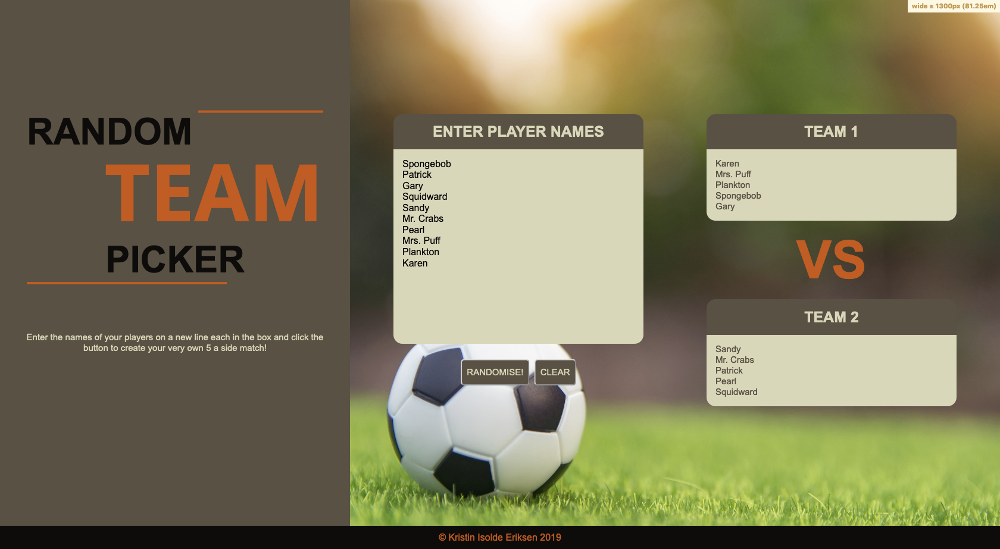

# Random Team Picker
This is the technical challenge and final project for the DevelopMe_ Fellowship coding bootcamp. 

## Table of contents
* [Brief](#brief)
* [Planning and Process](#planning)
* [Technologies](#technologies)
* [Wireframes](#wireframes)
* [Screenshots](#screenshots)
* [Setup](#setup)
* [Features](#features)
* [Future Improvements](#future-improvements)

## Brief
The exercise is to create a tool which randomly picks 5-a-side football teams from a list of 10 names (10 players = 2 teams of 5).
It's up to each student how they implement this, with JavaScript, PHP, as a web page, or as an app.

Optional advanced features might include:
* support for n-a-side, where a list of any length can be split into two teams
* support for balancing of the teams, where some measure of each player's strength is used to allocate teams fairly

## Planning and Process
The first step I took was to have a think about what I wanted my MVP to be, what would be achievable within the time limit, and what should be set as stretch goals rather than part of the MVP itself.

I decided that my MVP would need to be able to do the following:
* Must be able to take custom input names
* Must be able to arrange these into two separate arrays
* Must be able to return the randomly generated team back to the user
* Must have a minimal amount of CSS styling to improve looks
* Must be accessible to all users

Once I had set out the above goals, I thought about what technologies I wanted to use to create my MVP. I decided to opt for simplicity and use the technologies I felt the most comfortable with, to ensure my time was spent in the best way possible. I decided to create the product as a website, using HTML, SASS and JavaScript.

With my goals in place I then spent some time researching other team picker websites and apps, to see how other developers have solved similar challenges before me. I then spent some time thinking about how I would go about making my product stand out, and what I could do differently.

After this I created the wireframe designs using [Wireframe.cc](wireframe.cc/). I decided to design from mobile first, because additional code required for larger views can slow down the load time and is not necessary for mobile users. In addition, I also considered that many mobile users may be on a slow connection or have limited data. I then built up to the tablet version and desktop versions. After I created the wireframe layouts, I researched colour schemes that I felt were suitable for the vibe and purpose of the product, picking a colour scheme that I felt reflected the 'outdoorsiness' of football.

Once the wireframes were in place I started by first setting up the HTML in index.html, including the classes needed for minimal styling. I then created a folder for my stylesheets, and set up SASS, outputting the styling components into a single CSS file that would not be touched, which I linked to in index.html. I set up the styling settings first in settings.scss, using my selected colour scheme and accessibility friendly fonts and font sizes.

After the basic page was set up, I created the main.js JavaScript file and began working on the functionality. The JavaScript is set up in the following order:
* Set up an event listener, which will fire when the Randomise button is clicked. This event listener wraps around most of the code, as I only want it to run once the button has been clicked
* Get the names from the text box using getElementById, split them and store them in an array
* The names are then 'shuffled' in a function which uses a while loop (as we do not know how many names have been entered), which selects a random index using Math.floor and Math.random, then returns a new array
* The array is then sliced in half, creating two new arrays
* Creating a function that uses another while loop, child nodes are removed so that the names are not duplicated if the button is clicked again. Then, using a for loop set to the length of the array, each name is inserted back into the HTML using insertAdjacentHTML to put each name into its own div tag. This function is called on twice, once for each new array
* The last block of code listens to the second button, and sets the value of the text area back to empty when clicked

Once the JavaScript was working properly, I could focus on the styling again and refine it. Using [SASS-MQ](https://github.com/sass-mq/sass-mq), I amended the styling so that it starts with the mobile design, then builds up to tablet, desktop and wide desktop view. 

Finally, I checked the accessibility of my code using [WAVE](https://wave.webaim.org/) Web Accessibility Evaluation Tool to ensure the website is accessible to all users.

## Technologies
* HTML5
* CSS / SASS / SASS-MQ
* JavaScript
* Git
* Command Line
* GIMP Image Editor 2.10
* Adobe Color
* Google Fonts
* Accessibility checking tools

## Wireframes
* [Desktop](https://wireframe.cc/Jxg0bS)
* [Tablet](https://wireframe.cc/EhHF0W)
* [Mobile](https://wireframe.cc/Tlc12X)

## Screenshots

## Setup
Simply download the repository and open index.html in your browser.

## Features
The website features:
* A textarea in which you can enter the names of your players
* A JavaScript Event Listener that fires when the first button is clicked
* JavaScript code blocks that take the value of the text area, picks a random index from the array, slices the array into two separate arrays, removes child nodes from the array to avoid duplications if the button is clicked twice, and a loop that uses insertAdjacentHTML to create new HTML tags to insert each name back into the HTML
* A second button that clears the contents of the text area
* A responsive design layout that has been optimised for four different device widths: mobile, tablet, desktop and wide desktop
* Efficient mobile first styling with elegant media queries using [SASS-MQ](https://github.com/sass-mq/sass-mq)
* Used [WAVE](https://wave.webaim.org/) Web Accessibility Evaluation Tool to ensure the website is accessible to all

## Future Improvements
For the sake of ensuring I had a functional MVP within the time limit, I opted for simplicity to give myself enough time to complete the challenge. However, there are several things I would like to do to improve the product:
* Convert the website to a ReactJS app
* Create an API that would save the team names to a database, and a function that would let the user name their teams, and retrieve the teams from the database at any time
* Create support for balancing of the teams, where some measure of each player's strength is used to allocate teams fairly
* Create additional pages, for example a log in page where the user can save and retrieve their saved teams, create new teams and share them with friends